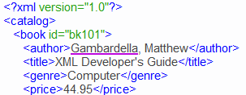
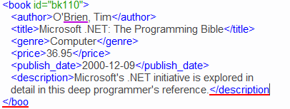
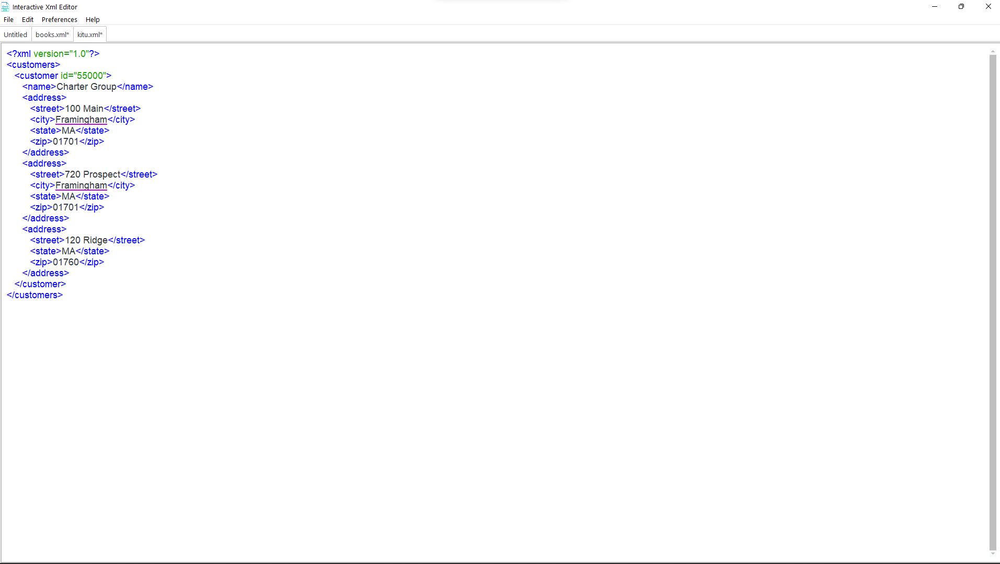
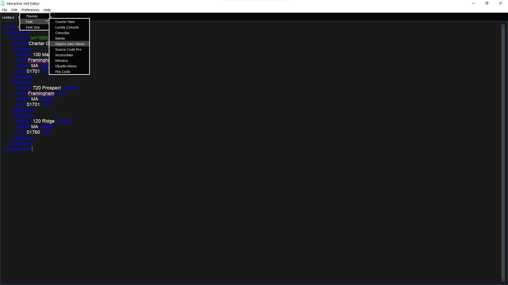

# Interactive-XML-editor
This is an interactive XML editor made using python ttk bootstrap package and Tkinter. It is a simple XML editor that allows you to create, open, edit, and save XML files. It also has a preferences menu that allows you to change the font size, font family, and font style.
It also has a dark mode and a light mode. It also has a spell checker that checks for spelling errors in the XML file and highlights them in purple.

Syntax highlighting is also available for the XML tags and attributes, if there is an error in the XML file, the line with the error will be highlighted in red. 

## Installation
1. Clone the repository
2. Install the requirements using `pip install -r requirements.txt`
3. Run the program using `python main.py`
4. Enjoy!
## Executable file
1. If you want to create an executable file, run `pyinstaller --onefile --windowed main.py` in the root directory of the project.
2. The executable file will be created in the `dist` folder.
3. Executable can be found from the releases section of this repository.
3. Enjoy!

## Screenshots
### Light mode

### Dark mode

## Features
1. Create new XML files
2. Open existing XML files
3. Save XML files
4. Save XML files as
5. Preferences menu
6. Dark mode
7. Light mode
8. Change font size
9. Change font family
10. Change font style

## Libraries used
1. Tkinter
2. ttkbootstrap
3. pyenchant (for spell checking)

## License
MIT License

Copyright (c) 2023 Alex Gathua

Permission is hereby granted, free of charge, to any person obtaining a copy
of this software and associated documentation files (the "Software"), to deal
in the Software without restriction, including without limitation the rights
to use, copy, modify, merge, publish, distribute, sublicense, and/or sell
copies of the Software, and to permit persons to whom the Software is
furnished to do so, subject to the following conditions:

The above copyright notice and this permission notice shall be included in all
copies or substantial portions of the Software.

THE SOFTWARE IS PROVIDED "AS IS", WITHOUT WARRANTY OF ANY KIND, EXPRESS OR
IMPLIED, INCLUDING BUT NOT LIMITED TO THE WARRANTIES OF MERCHANTABILITY,
FITNESS FOR A PARTICULAR PURPOSE AND NONINFRINGEMENT. IN NO EVENT SHALL THE
AUTHORS OR COPYRIGHT HOLDERS BE LIABLE FOR ANY CLAIM, DAMAGES OR OTHER
LIABILITY, WHETHER IN AN ACTION OF CONTRACT, TORT OR OTHERWISE, ARISING FROM,
OUT OF OR IN CONNECTION WITH THE SOFTWARE OR THE USE OR OTHER DEALINGS IN THE
SOFTWARE.

